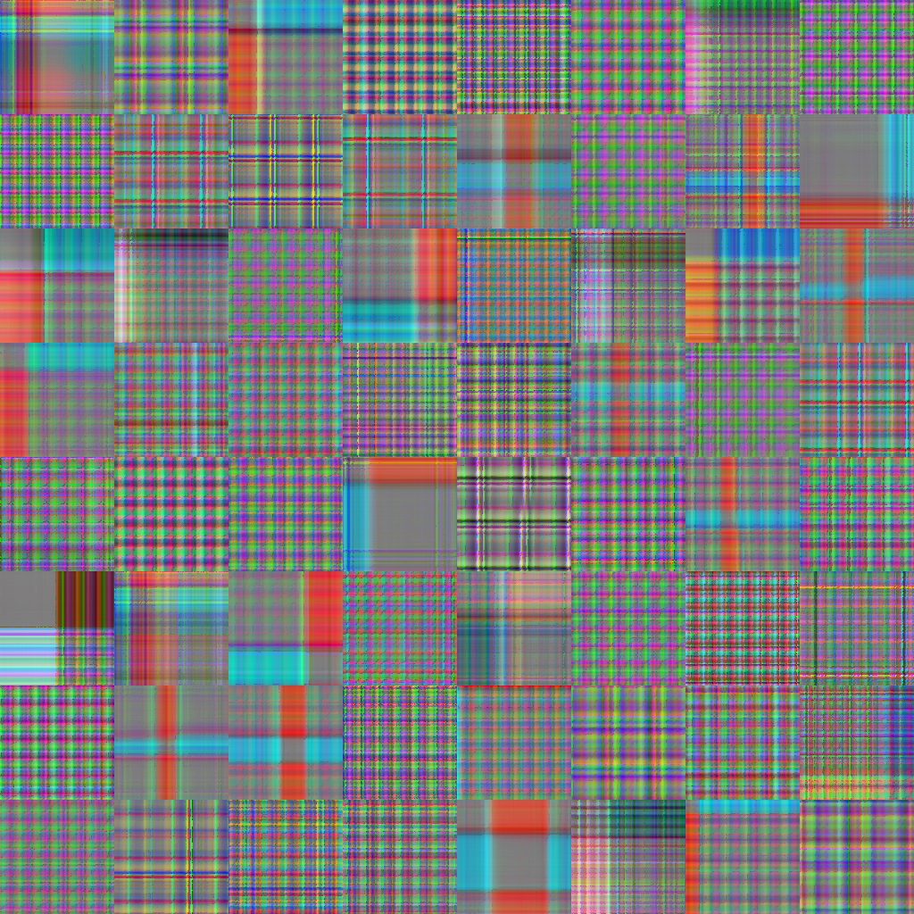
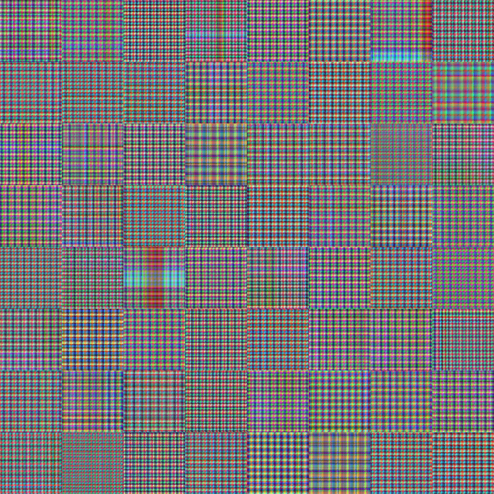
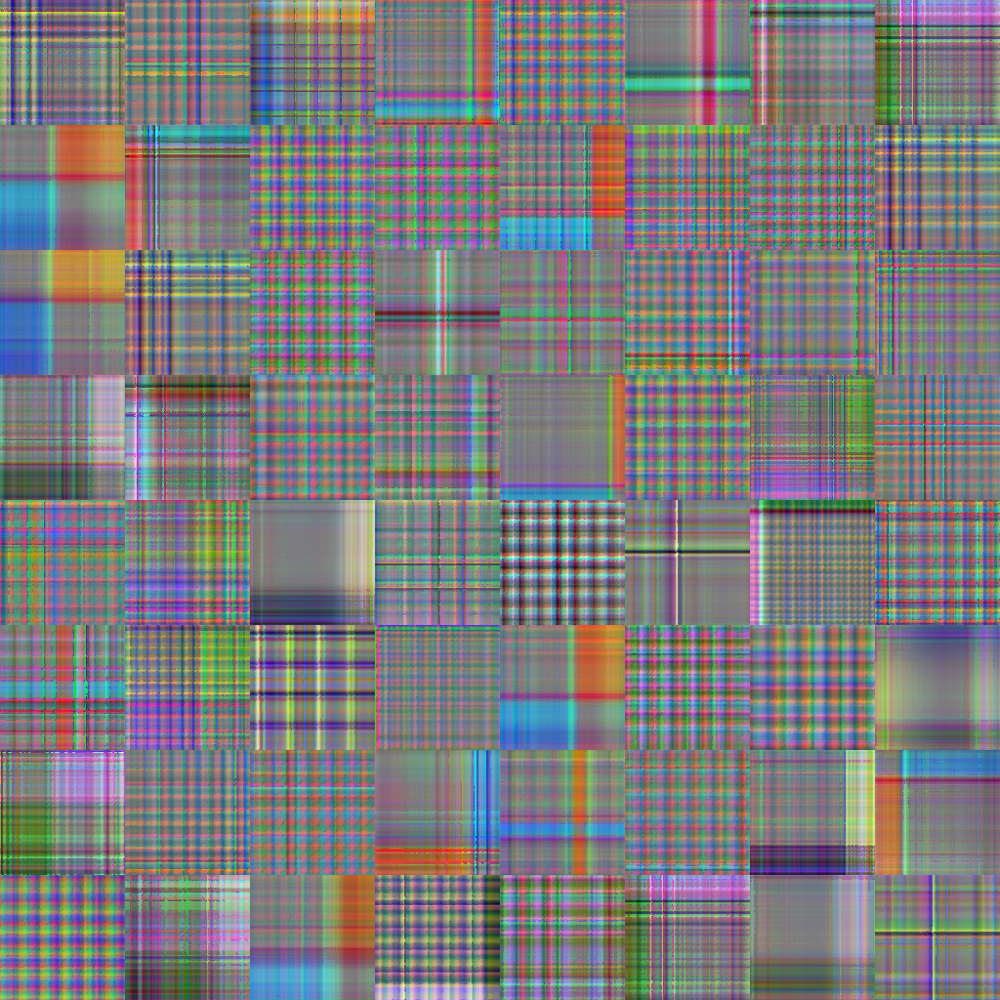
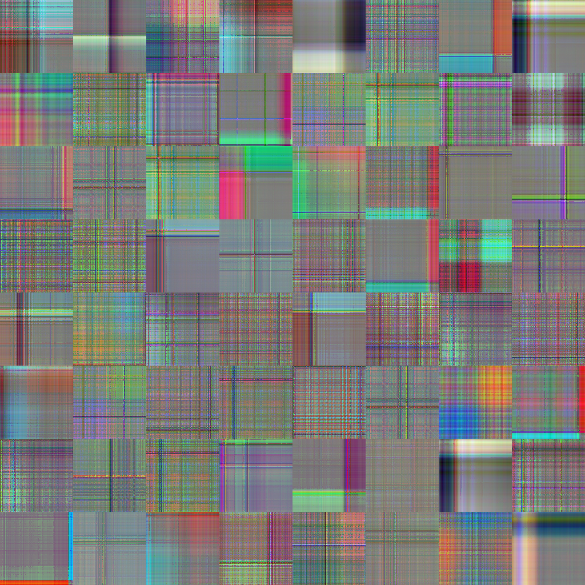
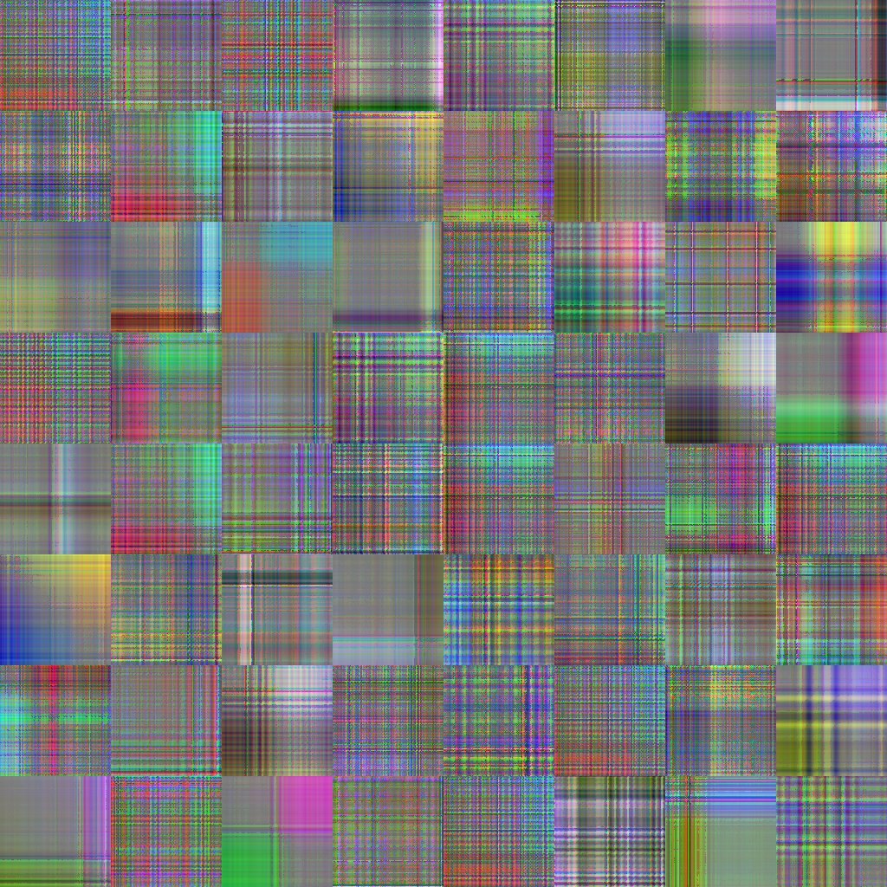

# Official Implementation: TFG Diseño e implementación de la reconstrucción de series temporales a partir de imágenes

[](https://github.com/frangam/diff-tsd/stargazers)
[](https://github.com/frangam/diff-tsd/network/members)
[](https://opensource.org/licenses/MIT)  [](https://github.com/frangam/diff-tsd/releases/download/1.0/diff-tsd.zip)

[[`Paper`]Coming Soon] [[`Dataset`](#our-recurrence-plots-dataset)] [[`Citation`](#citation)]


Welcome to the official implementation repository of the TFG "Diseño e implementación de la reconstrucción de series temporales a partir de imágenes" based on paper titled "Diff-TSD: Modelling Time-series Data Generation with Diffusion Models". This repository provides detailed insights, datasets, and other essential resources related to our research and findings.

## Introduction

In the TFG "Diseño e implementación de la reconstrucción de series temporales a partir de imágenes", we explore the potential of reconstruction of the different image codification techniques and intricacies of generating time-series data using diffusion models. As an integral part of this work, this repository serves as a comprehensive platform to access the datasets, recurrence plots,grammian angular fields, markov transition fields and other relevant resources that were instrumental in our research.


## Dataset
We used WISDM dataset. The [WISDM dataset](https://ieeexplore.ieee.org/document/8835065/) focuses on data from smartwatch wearables. Our study particularly delves into the dataset which records 51 subjects performing 18 daily activities, such as "walking" and "jogging". We've honed in on five non-hand-oriented activities: "walking", "jogging", "stairs" (both ascending and descending), "sitting", and "standing", amassing a total of 1,053,141 instances. Data collection utilized the smartwatch's accelerometer, recording at a frequency of 20 Hz. For a visual representation of the acceleration waveforms for each activity.

### Activity Distribution of WISDM

| Activity | Instances | Percentage |
|----------|-----------|------------|
| Standing | 216,529   | 20.6%      |
| Sitting  | 213,018   | 20.2%      |
| Walking  | 210,495   | 20.0%      |
| Stairs   | 207,312   | 19.7%      |
| Jogging  | 205,787   | 19.5%      |

As is common in various studies [^1^] utilizing this dataset for classification tasks, we opted to segment the data into full non-overlapping windowed segments (FNOW). Each segment contains 129 data points. The choice of 129, while seemingly unusual, is intentional; one additional data point beyond the typical 128 [^1^] allows us to create recurrence plots of 128x128 pixels.

[^1^]: Abdel-Salam, H., Pham, T., & Elgendi, M. (2021). A Benchmark Dataset and Evaluation of Human Activity Recognition on Smartphones. *Journal of Information*.


## Execution in background 
You can run the scripts with [nohup](https://en.wikipedia.org/wiki/Nohup) which ignores the hangup signal. This means that you can close the terminal without stopping the execution. Also, don’t forget to add & so the script runs in the background:

```sh
$ nohup accelerate launch train.py --config CONFIG_FILE  > your.log &
```

In addition, to close remote terminal safely, you have to run the exit commant, and do not close manually the terminal:

```sh
$ exit
```

Finally, you can identify the running processes of training script with:
```sh
$ ps ax | grep train.py
```

or list of all running processes of Python:
```sh
$ ps -fA | grep python
```

then, kill the desired one:

```sh
$ kill PID
```

## 1. Create Data Splits
In all bash command, we can combine the use "nohup" command to execute a script withouth interuptions (avoiding terminal disconnections, etc.) and "&" symbol at the end of the command for a background execution. We also can use "> filename.log" to put the results in a log file.

**Sampling techniques**
- The Leave-One-Trial-Out (LOTO) approach is a cutting-edge method in sample generation. Each trial encompasses a unique raw activity signal for a single subject, ensuring an impartial evaluation and facilitating the creation of a sufficient number of samples. Additionally, this technique prevents the duplication of trials with identical raw signals (trials of the same label) across both training and testing datasets.
- The Leave-One-Subject-Out (LOSO) approach is a sampling technique inspired by the Leave-One-Trial-Out method. In this approach, all trials belonging to a single subject are considered as an indivisible unit, ensuring that there are no trials from the same subject duplicated in the training and testing datasets. This technique maintains data integrity and prevents potential biases caused by the presence of trials from the same subject in both datasets, allowing for a more robust and reliable evaluation of the model's performance. This technique is the most strict, which proposes a subject-wise approach instead record-wise, and in the literature is not commonly assessed, maybe due to its resulting lower accuracy.


### Our Recurrence plots Dataset

We performed two experiments: One using LOTO to compare our results with previous results and the other using LOSO.

The table below presents the 3-fold data distribution for each sampling approach:

The table below presents the 3-fold data distribution for each sampling approach:

<table>
  <thead>
    <tr>
      <th rowspan="2">3-Folds</th>
      <th colspan="3">FNOW + LOTO</th>
      <th colspan="3">FNOW + LOSO</th>
    </tr>
    <tr>
      <th>Train samples</th>
      <th>Test samples</th>
      <th>Total</th>
      <th>Train samples</th>
      <th>Test samples</th>
      <th>Total</th>
    </tr>
  </thead>
  <tbody>
    <tr>
      <td>Fold-1</td>
      <td>5392</td>
      <td>2672</td>
      <td>8064</td>
      <td>5408</td>
      <td>2688</td>
      <td>8096</td>
    </tr>
    <tr>
      <td>Fold-2</td>
      <td>5392</td>
      <td>2688</td>
      <td>8080</td>
      <td>5344</td>
      <td>2768</td>
      <td>8112</td>
    </tr>
    <tr>
      <td>Fold-3</td>
      <td>5392</td>
      <td>2672</td>
      <td>8064</td>
      <td>5456</td>
      <td>2640</td>
      <td>8096</td>
    </tr>
  </tbody>
</table>


So, from the WISDM dataset, we extracted [Recurrence plots](https://ieeexplore.ieee.org/document/8691521/) with a legnth of 129 points (128x128 pixels) were generated for each of the five selected classes across every fold. These plots, inspired by the work of Lu and Tong in "Robust Single Accelerometer-Based Activity Recognition Using Modified Recurrence Plot", are available for download on the Hugging Face platform.


Here, an example of the reccurente plots dataset:

<table>
<tr>
    <td>
        <br>
        <center>Class 0 (Walking)</center>
    </td>
    <td>
        <br>
        <center>Class 1 (Jogging)</center>
    </td>
    <td>
        <br>
        <center>Class 2 (Stairs)</center>
    </td>
</tr>
<tr>
    <td>
        <br>
        <center>Class 3 (Sitting)</center>
    </td>
    <td>
        <br>
        <center>Class 4 (Standing)</center>
    </td>
</tr>
</table>


### Create Images (RP,GASF,MTF)
If you want to create recurrence plots:

- "--create-numpies" is for create the first time the numpy arrays.
- With "--sampling loto" you can select the sampling method "loto" or "loso" with "--sampling loso".
- With "--image type " you can select the image construction or reconstruction method "--sampling loso".
For LOTO approach:
```sh
 $ nohup ./generate_images.py  --data-name WISDM --n-folds 3 --image-type GAF --data-folder /home/adriano/Escritorio/TFG/data/WISDM/  --sampling loto > generate_images.log &

```


### Reconstruct Images (RP,GASF,MTF)
Then, we have to execute once generated the images  the reconstruction of the time series:

```sh
 $ nohup  ./generate_time_series.py --data-name WISDM --n-folds 3 --image-type GAF --data-folder /home/adriano/Escritorio/TFG/data/WISDM/  --sampling loto > ts_plots_loto.log &

```


---

